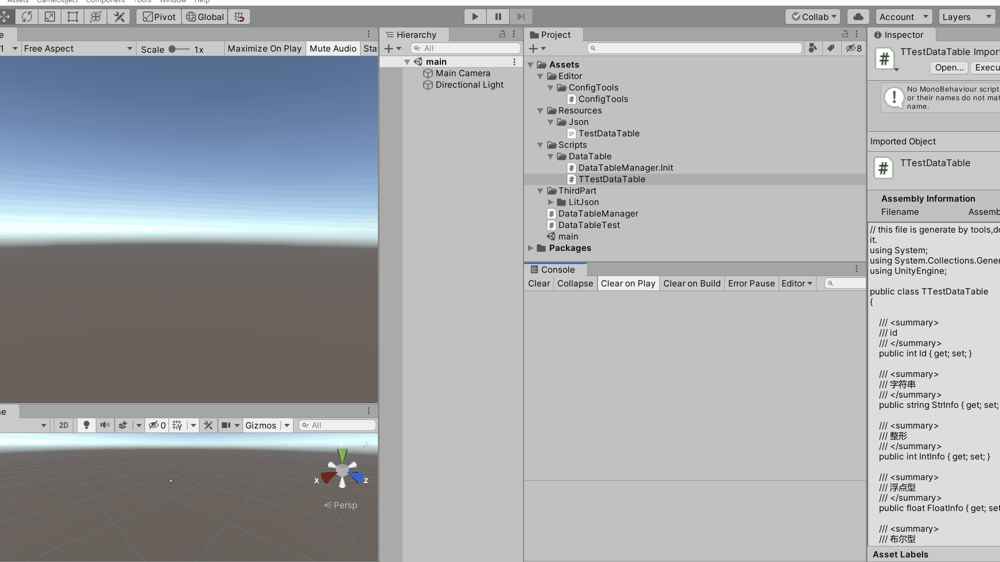

### unity中Excel转C#相关配置工具
（此方案并不是比较友好的方案，支持的相关数据类型并不充足，相关的枚举、公共配置并没有添加进去。有需求再做其他的配置方案）  
相关步骤：将Excel相关数据转为json字符串，并保存在对应位置。
应用启动后在指定位置加载json，并使用litjson插件序列化为对应的类对象。

1. 需要注意的是，配置表**首个字段名称需为Id，类型为int**，
   类型名称为#号的列不再解析。
2. 支持相关数据类型如下

| 类型                  | 说明           | 默认值       |
|---------------------|--------------|-----------|
| int                 | 整形           | 0         |
| float               | 浮点型          | 0         |
| bool                | bool型        | false     |
| string              | 字符串          | ""        |
3. 由于litjson的局限性（可自行修改litjson库），对于其他的复杂类型（如Vector3,List），可通过字符串自行实现
4. 使用如下  
